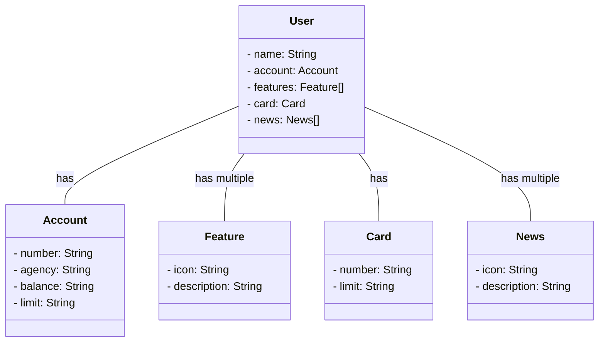

# Santander Dev Week 2023

Java RESTful API criada para a Santander Dev Week.

## Tecnologias Utilizadas
- **Java 17**;
- **Spring Boot 3**
- **Spring Data JPA**
- **OpenAPI (Swagger)**
- **Railway**

### Diagrama de Classes

### Deploy

O deploy desta API foi realizado com [Railway](railway.app/) e pode ser encontrado no seguinte domínio: (https://sdw-2023-jessicakisner-production.up.railway.app/)

### A API no Swagger

A documentação da API pode ser vista e editada no Swagger no seguinte domínio: (https://sdw-2023-jessicakisner-production.up.railway.app/swagger-ui/index.html)

### Referência

Esta API foi criada como parte do projeto do Santander Bootcamp 2023 - Backend Java, disponibilizado pela [Dio](https://web.dio.me)