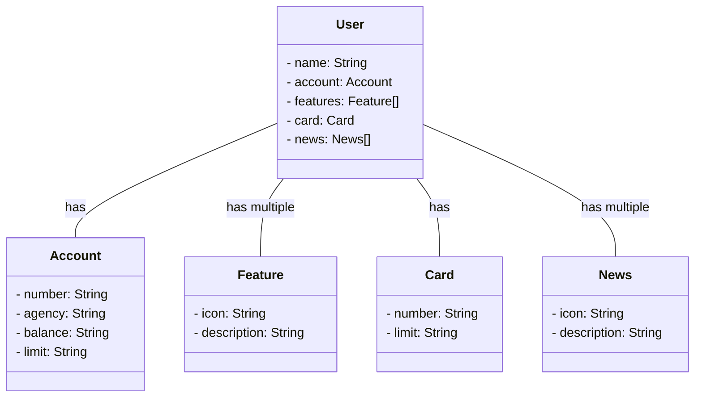

# Santander Dev Week 2023

Java RESTful API criada para a Santander Dev Week.

## Tecnologias Utilizadas
- **Java 17**: Utilizaremos a versão LTS mais recente do Java para tirar vantagem das últimas inovações que essa linguagem robusta e amplamente utilizada oferece;
- **Spring Boot 3**: Trabalharemos com a mais nova versão do Spring Boot, que maximiza a produtividade do desenvolvedor por meio de sua poderosa premissa de autoconfiguração;
- **Spring Data JPA**: Exploraremos como essa ferramenta pode simplificar nossa camada de acesso aos dados, facilitando a integração com bancos de dados SQL;
- **OpenAPI (Swagger)**: Vamos criar uma documentação de API eficaz e fácil de entender usando a OpenAPI (Swagger), perfeitamente alinhada com a alta produtividade que o Spring Boot oferece;
- **Railway**: facilita o deploy e monitoramento de nossas soluções na nuvem, além de oferecer diversos bancos de dados como serviço e pipelines de CI/CD.

### Diagrama de Classes

### Deploy

O deploy desta API foi realizado com [Railway](railway.app/) e pode ser encontrado no seguinte domínio: (https://sdw-2023-jessicakisner-production.up.railway.app/)

### A API no Swagger

A documentação da API pode ser vista e editada no Swagger no seguinte domínio: (https://sdw-2023-jessicakisner-production.up.railway.app/swagger-ui/index.html)

### Referência

Esta API foi criada como parte do projeto do Santander Bootcamp 2023 - Backend Java, disponibilizado pela [Dio](https://web.dio.me)